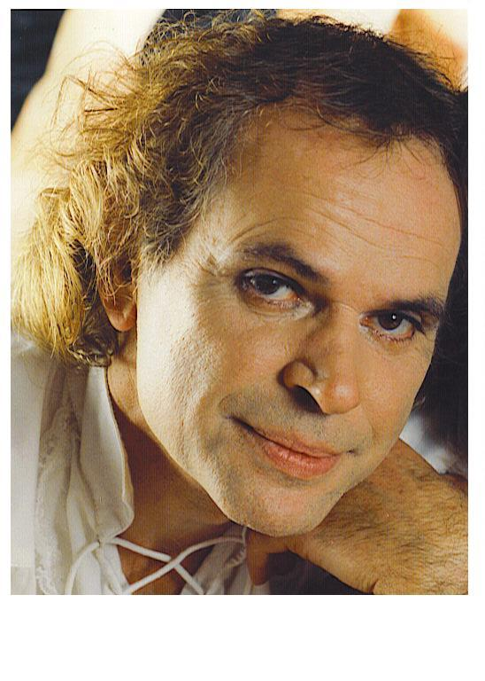
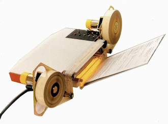
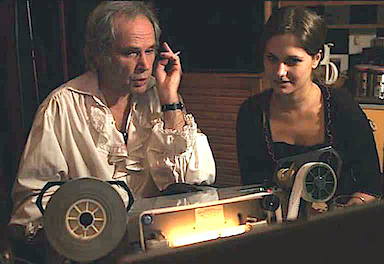

_Guy Desdames en 2003_

Guy Desdames est principalement connu dans le cinéma pour sa machine Orphée, qui a révolutionné les pratiques de la postsynchronisation et du doublage mais outre ses qualités de constructeur et de concepteur de systèmes, il est également réalisateur, producteur, comédien, photographe et écrivain.

## Enfance et formation.

Guy Desdames est né le 30 septembre 1948 en Bourgogne, ce qui lui vaudra un goût inné pour la dégustation, tant pour les vins que pour la gastronomie en général.
De courtes études techniques lui permettent de trouver très tôt un premier travail de dessinateur industriel dans une grande entreprise de construction électrique de la ville de Mâcon où il suit les cours du CNAM qui le mèneront à la qualification d’ingénieur en électrotechnique.
Ses goûts pour le graphisme feront évoluer son travail de dessinateur industriel vers celui de dessinateur catalogue, qu’il complète avec la photographie apprise en autodidacte grâce à d’heureuses rencontres faites pendant son séjour à Madagascar, où il a été envoyé comme infirmier après une formation expresse dispensée par le service santé de l’armée française.

Ses inclinations et son entourage le conduisent très vite à se manifester dans des domaines artistiques, dans un premier temps au sein de la troupe de théâtre mâconnaise “Les Histrions“, dirigée par Pierre Littner.

La prestation de Jean Pierre Sentier jouant le rôle de Guillaume Nogaret dans le Procès des Templiers aura sur lui un effet durable, lui donnant l’audace d’être le personnage principal de son premier court métrage expérimental “L’appétit chez les cannibales“ dont il compose également la musique originale. Il sera remarqué en 1975 aux Rencontres cinématographiques des jeunes auteurs de Belfort (non compétitives) dont le jury est présidé par Armand Deleule (dit Chartier) et un conseil des sages placé sous le regard du peintre cinéaste Robert Lapoujade et celui du critique cinéma Rui Nogueira.

Sa vocation est trouvée. Il abandonne l’industrie, devient comédien professionnel et avec deux autres mâconnais passionnés de cinéma, Jacques Donjon et Jean Monnier, il crée Arcane Films une société de production cinéma indépendante qui produira de nombreux documentaires de création axés principalement sur la société viticole qui constitue leur bassin culturel.
Cette activité dépassant le cadre de la production cinéma stricto sensu prendra l’allure d’une animation culturelle dont la presse rendra compte régulièrement.
Une association loi de 1901, l’ARAC est créé pour administrer ce pôle audiovisuel décentralisé comprenant aussi une école de cinéma.

Avec le concours du GREC (groupe de Recherche et d’Essais Cinématographiques), Guy Desdames réalise son deuxième film expérimental “Élixir de Vie“ soutenu par Jean Rouch et présenté au CNC en 1985.

Les cinéphiles mâconnais l’élisent président de leur cinéclub l’Embobiné, en 1985



- <https://www.lejsl.com/edition-macon/2015/05/03/carte-blanche-a-guy-desdames-1er-president-de-l-embobine>
- <https://www.lejsl.com/edition-macon/2015/05/07/30-ans-de-bons-souvenirs-revisites-au-cinema>

## Ingénieur et comédien

Il conçoit et construit les dispositifs de post-production donnant une totale autonomie de production à Arcane Films et souplesse pédagogique aux formations agréées qui sont dispensées sous sa responsabilité de Conseiller d’Éducation Populaire diplômé d’État. Qualités qui motiveront les visites en Bourgogne d’Yves Louchez, coordinateur d’Imagina et délégué général de la CST (Commission Supérieure Technique du Cinéma) ainsi que celle de Jean Jacques Languepin alors directeur d’études à l’IDEHC, aujourd’hui FEMIS.

La vidéo prenant de plus en plus de place dans la production audiovisuelle il réfléchit à des solutions permettant de coupler ces supports présentant d’avantageuses complémentarités, tant dans leurs caractéristiques techniques, que l’efficience budgétaire.

En 1987 il s’implante à Epinay-sur-Seine avec une nouvelle société, Acropole Movies International <https://www.youtube.com/@acropolemoviesinternational>
Tout en traitant la synchronisation d’auditoriums présentant de grandes complexités nées de techniques disparates, il développe un concept synchronisant supports vidéo et cinéma qu’il applique à sa machine Orphée, dont la maniabilité apportera modernisation et fiabilité appréciées des professionnels dans le domaine de la postsynchronisation et du doublage.

<https://fr.wikipedia.org/wiki/Doublage>

_La machine Orphée développée par Guy Desdames_

Cet outil réalisera dans ce secteur le pont avec les techniques numériques qui se mettent en place avec la généralisation de l’usage de l’ordinateur pour lequel le Centre National du Cinéma et de l’Image animée aidera significativement Guy Desdames dans la mission qui l’incombe dorénavant pour la modernisation de cette branche des industries techniques. Il organise régulièrement des événements
<https://www.leparisien.fr/seine-saint-denis-93/ici-il-y-a-un-authentique-dynamisme-18-03-2003-2003914398.php>
et crée des formations



pour promouvoir ce secteur où il apporte également un algorithme synchronisant le code temporel des systèmes PAL SECAM avec le NTSC drop-frame qui facilitera les échanges de programmes entre l’Europe et le continent américain.
<https://phonations.github.io/fr>

Sa double compétence de technicien et de comédien lui vaut d’être sollicité par différents studios de la place parisienne où il assure les travaux de finition de nombreux films notamment la série des “Nestor Burma“ dans laquelle Guy Marchand tient le rôle principal. <https://www.imdb.com/fr/name/nm2637654/>

Il joue le rôle du grand Zarathoustra dans “Show buzz“ \*de Rached M’dini, dont il a produit les premiers films.



<https://www.imdb.com/fr/name/nm2637654/>

En 2015, il joue le rôle de Patrice Durand (alias DSK), interprétation en anglais, dans le film The American Banker réal Jeff Espanol, prod FTM INC 7095 Hollywood

Il prête son dos et sa silhouette à Léo Ferré dans le web doc “Léo Ferré un homme libre“, réalisation Natalie Frassoni, prod Lady Birds Films Paris.
<https://www.capuseen.com/films/7787-leo-ferre-un-homme-libre>

Gérard Courant lui a consacré le Cinématon N° 2875, dans sa série de portraits de personnalités des arts et du spectacle.



En 2012, il est membre du jury du festival international du court métrage de Sens

## Photographe

Il collabore régulièrement au magazine Moto Journal, dans l’équipe de Frédéric Poujouly. <https://www.linkedin.com/in/fr%C3%A9d%C3%A9ric-poujouly-3bb6b36/?originalSubdomain=fr>
<https://fr.downmagaz.net/car_magazine_moto_francaise/98986-moto-journal-fevrier-2025-no-2379.html>

Il produit d’innombrables photos et vidéos de concerts de musiciens tourné en un seul plan sans montage, pour la promotion d’artistes de son entourage.
<https://www.facebook.com/lucas.montagnier.1/videos/704452308632552>

En 1983 il prend l’initiative de l’exposition des travaux du peintre graveur Michel Joyard au Musée des Ursulines de Mâcon. À cette occasion il produit une abondante iconographie sur l’artiste auquel il avait consacré un essai destiné aux professionnels.
<https://www.joyard.art/biographie>

## Écrivain

Son parcours riche d’expériences diverses
<https://rxcmusic.bandcamp.com/track/comptoir-feat-guy-desdames>
lui inspire un premier récit “Les Très Riches Heures du Chevalier des Dames“ où il fait l’apologie de l’amour, ce qui le range dans une catégorie ne présentant aucun danger, sauf que l’amour est un domaine si vaste qu’on peut aimer des choses que d’autres n’aiment pas. C’est là que les points de vue se divisent et comme ça que commencent les confits.
ISBN 979-10-415-0296-7

Alors dans “Les Cahiers du Beurdin“, il adopte un angle inattendu en nous prévenant des risques de la croyance, qui a abusé tant d’âmes.
En conséquence il vaut mieux se fier à notre expérience pour avancer sainement. Il est donc utile, voire indispensable de connaître le passé pour comprendre le présent et pour envisager l’avenir, appliquer la même logique.
ISBN 979-10-976-3610-4

“On ne naît pas Parisien, on le devient“ est son autobiographie et ce sont carrément des millénaires qu’il ne se gêne pas d’ausculter depuis le fond de son lit.
En réalité, cette acuité ne lui vientelle pas de la simplicité des tréfonds de ses origines rurales où tout doit se faire en interaction avec les lois dictées par la nature, le cosmos.
ISBN 979-10-415-3881-2

“Sous le ciel de la rue Saint Denis“ est une monographie qu’il consacre au quartier où il partage des jours heureux avec son voisinage en faisant tomber quelques idées reçues, par exemple celle selon laquelle les Parisiens ne seraient pas sociables et avec une même facilité, quelques mythes qu’il est bon de voir enfin éclairés au coin du bon sens.
Dépôt légal à la BNF 0000001218328

Ce tableau serait incomplet sans la touche de distance amusée qui lui valut d’être intronisé Beurdignaud dans une fratrie de joyeux drilles, les Beurdins de Bourbon-Lancy.
<https://www.lejsl.com/societe/2022/09/24/la-fratrie-des-beurdins-intronise-un-beurdiniaud-aux-multiples-facettes-artistiques>

_Le film Show Buzz de Rached M’dini se termine avec un plan sur Guy Desdames aux commandes de sa machine Orphée. Rached M’dini donne à Orphée le pouvoir de commander le dé-nouement de l’histoire qui n’aurait pas connu de fin sans le regard privilégié offert par cet instru-ment, facilitant l’architecture du montage et permettant de faire dire aux acteurs ce qui est opportun pour l’économie artistique de l’œuvre._

